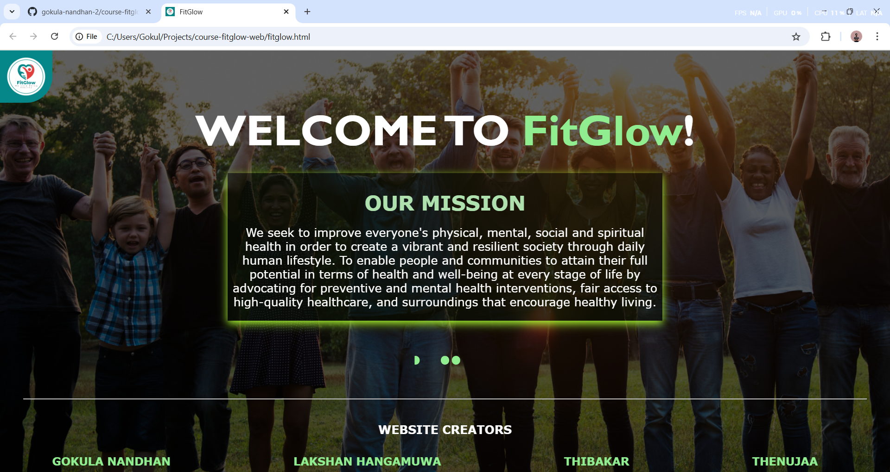
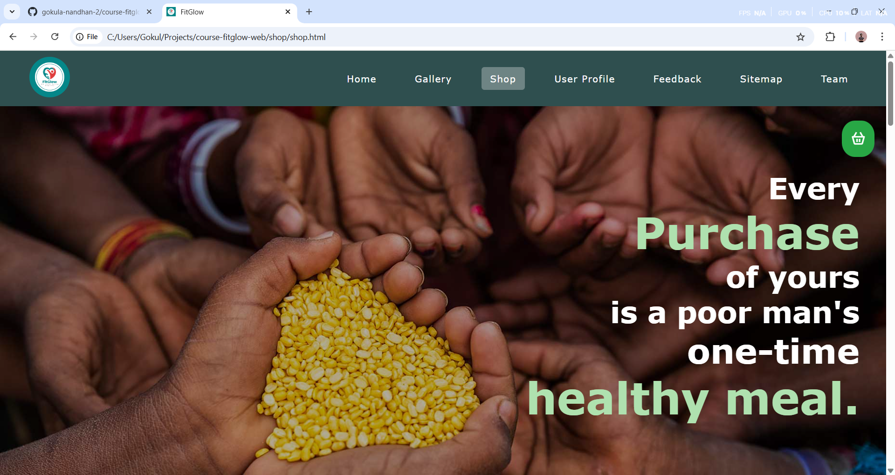
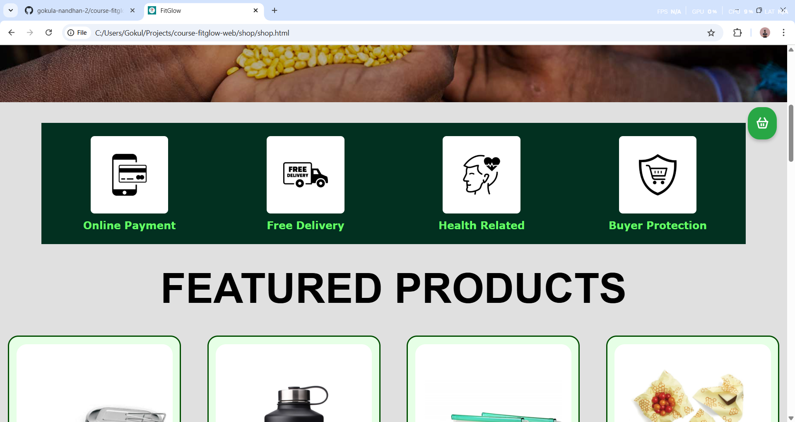
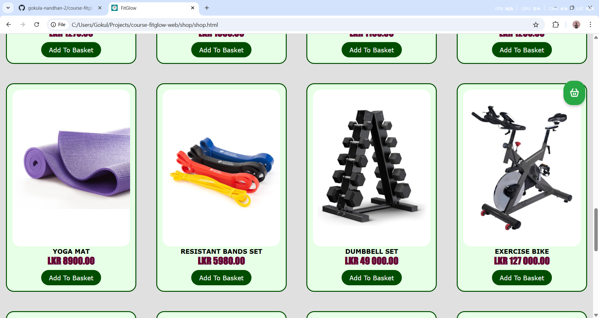
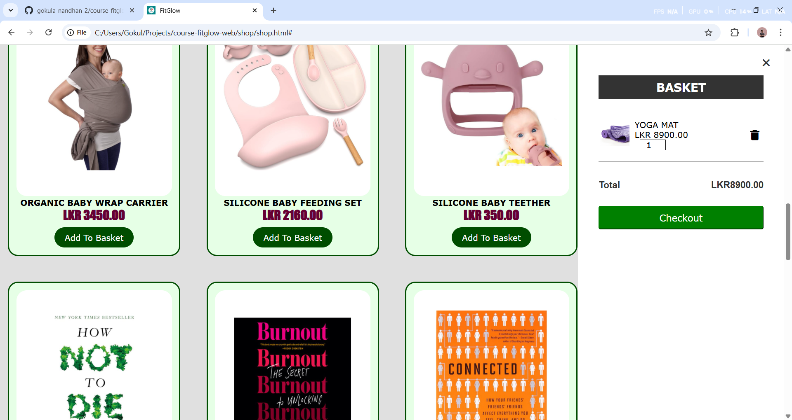
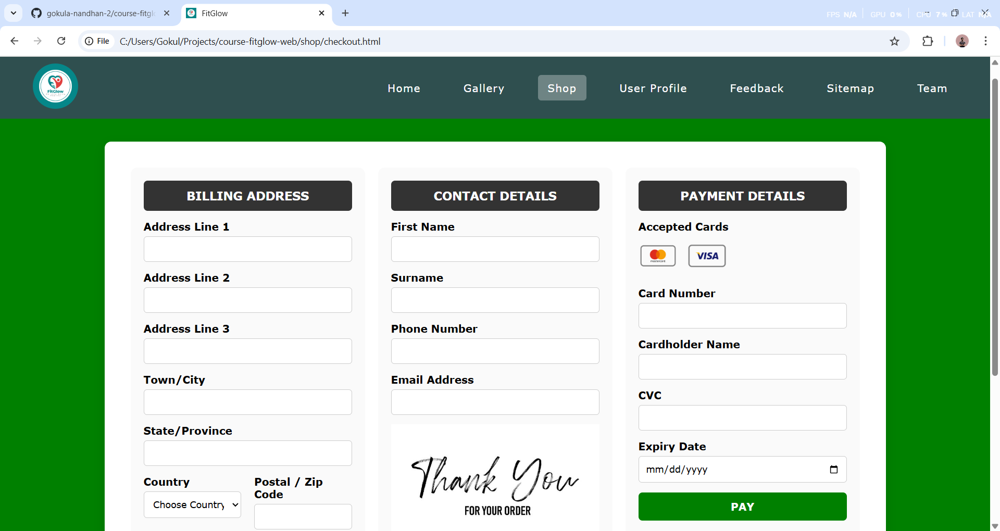
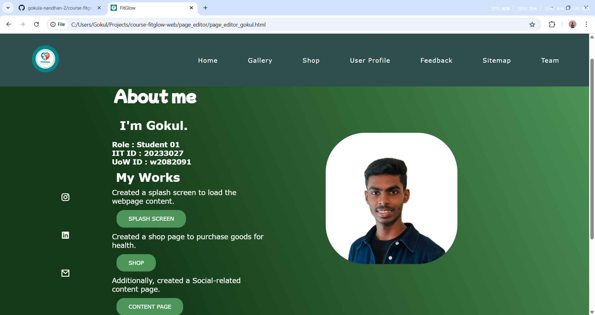
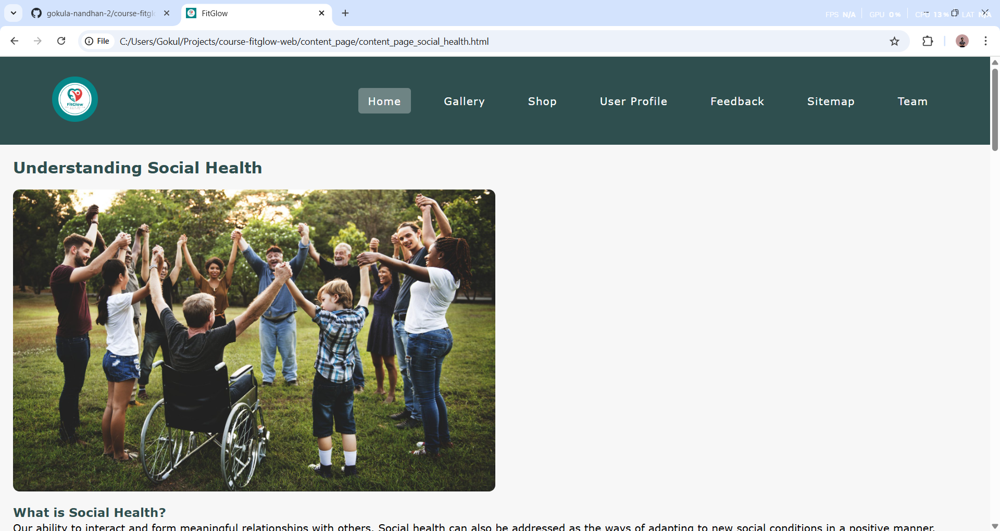
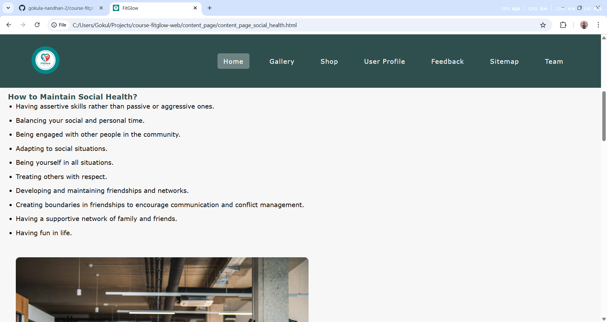

# 🌿 FitGlow – Good Health & Well-Being Website  

  
  
  
  

---

## 📌 Overview  
FitGlow is a group coursework project developed for the **Web Design & Development** module at the University of Westminster.  

The website is aligned with the **United Nations Sustainable Development Goal (SDG 3: Good Health & Well-Being)** and aims to:  
- Educate users about mental, physical, social, and spiritual health.  
- Provide interactive features for engagement.  
- Encourage healthy lifestyle choices through design and content.  

---

## 🗂️ Project Structure  

```bash
FitGlow/
│── assets/                # Common assets (images, header, footer, css, js)  
│── content_page/          # Four content pages (Mental, Physical, Social, Spiritual Health)  
│── feedback/              # Feedback form (HTML + JS)  
│── gallery/               # Gallery page (HTML + CSS + JS)  
│── home_page/             # Home page with navigation and template  
│── page_editor/           # Individual editors’ pages (team contributions)  
│── shop/                  # Shop page (products + cart system)  
│── sitemap/               # Interactive SVG sitemap  
│── splash_screen/         # Splash screen with auto-redirect  
│── team/                  # Team members’ info page  
│── user_profile/          # Progressive user profile  
│── fitglow.html           # Main opening page (entry point)  
│── README.md              # Project documentation
```  

---

## 👨‍💻 Team Roles  
- **Student 1 (Me)** – Splash Screen & Shop Page  
- **Student 2** – Home Page, Template & Navigation, Feedback Form  
- **Student 3** – User Profile, Team Page  
- **Student 4** – Gallery, Sitemap  

👉 All students contributed to **Content Pages**, **Page Editors**, and integration.  

---

## ✨ Features  

### ✅ Student 1 Contributions  
- **Splash Screen (`splash_screen/`)**  
  - Displays website mission and team members.  
  - Loader animation + auto-redirect to home page.  

- **Shop Page (`shop/`)**  
  - Product showcase with images, details, and pricing.  
  - Add-to-cart functionality with basket summary.  
  - Checkout form with validation + confirmation message.  

### ✅ Team Contributions  
- **Home Page & Template (Student 2):** Navigation bar, logo, mission statement.  
- **Feedback Form (Student 2):** Validation, preview, confirmation.  
- **User Profile (Student 3):** Guided profile creation with progress bar.  
- **Team Page (Student 3):** Interactive thumbnails with member details.  
- **Gallery (Student 4):** Expandable thumbnails + customization.  
- **Sitemap (Student 4):** SVG-based interactive site structure.  
- **Content Pages (All):** Mental, Physical, Social, Spiritual health.  
- **Page Editors (All):** Logs of individual contributions.  

---

## 🛠️ Technologies Used  
- **HTML5** – Semantic structure & accessibility  
- **CSS3** – Styling, responsive design, animations  
- **JavaScript (ES6)** – Interactivity (cart system, redirects, form validation)  

---

## 🚀 How to Run  
1. Clone or download this repository.  
2. Open **`fitglow.html`** in any modern web browser.  
3. Navigate through the splash screen → home page → all sections.  

---

## 📷 Screenshots 

- Splash Screen
  

 
- Shop Page






- Editors's Page



- Content Page  




---

## 📖 Learning Outcomes  
- Building linked HTML documents with modular structure.  
- Applying separation of concerns: **HTML (structure)**, **CSS (style)**, **JS (behavior)**.  
- Designing interactive features with JavaScript.  
- Collaborating effectively in a group project.  

---

✨ *Developed by Team FitGlow* ✨  

